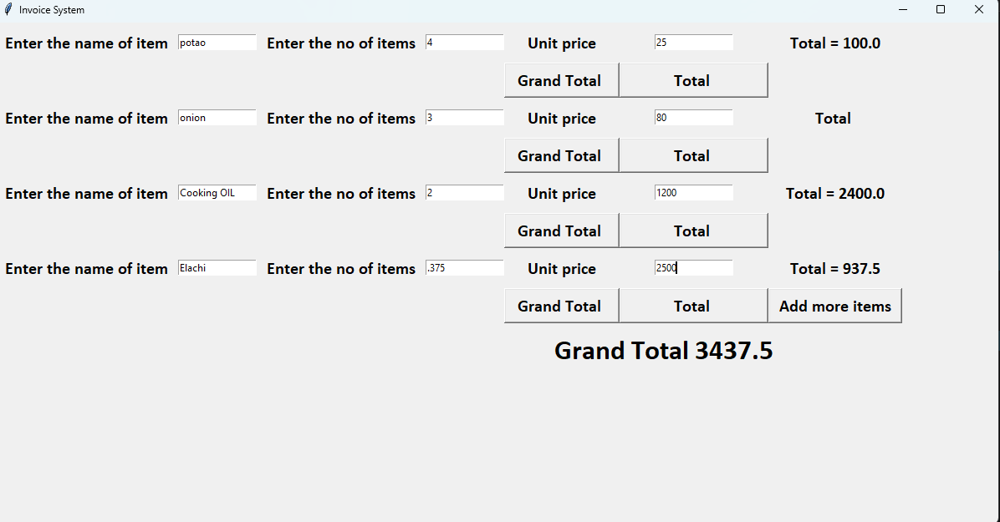

# Invoice System

A simple Invoice Management System built with **Python Tkinter** that allows users to add multiple items, calculate individual item totals, and compute a grand total.

---

## Features

- Add multiple invoice items dynamically
- Enter item name, quantity, and unit price
- Calculate total for each item
- Calculate grand total
- User-friendly Tkinter GUI
- Beginner-friendly project for learning GUI development

---

## Technologies Used

- Python 3
- Tkinter

---

## Project Structure

```text
Invoice-System/
│
├── invoice.py
├── output.png
└── README.md
```

---

## Installation

### Clone the Repository

```bash
git clone https://github.com/your-username/invoice-system.git
```

### Navigate to the Project Folder

```bash
cd invoice-system
```

### Run the Program

```bash
python invoice.py
```

---

## Usage

### 1. Add Item Row

Click **Add more items** to create a new row for invoice entry.

### 2. Enter Details

Fill in:

- Item Name
- Number of Items
- Unit Price

### 3. Calculate Total

Click the **Total** button.

Formula:

```text
Total = Quantity × Unit Price
```

Example:

```text
Quantity = 5
Unit Price = 10

Total = 50
```

### 4. Calculate Grand Total

Click **Grand Total** to display the sum of all item totals.

---

## Example

### Input

| Item | Quantity | Unit Price |
|--------|----------|------------|
| Pen | 5 | 10 |
| Book | 2 | 100 |

### Output

| Item | Total |
|--------|-------|
| Pen | 50 |
| Book | 200 |

Grand Total:

```text
250
```

---

## Output Screenshot

### Application Interface




```

---

## Limitations

- No input validation
- Empty fields cause errors
- Non-numeric input causes exceptions
- Clicking Total multiple times adds duplicate amounts
- Item names are not stored
- No invoice saving functionality

---

## Future Improvements

- Input validation
- Delete item feature
- Save invoice as TXT/PDF
- SQLite database integration
- Tax calculation
- Discount support
- Print invoice feature

---

## Learning Outcomes

This project demonstrates:

- Tkinter GUI Development
- Grid Layout Manager
- Labels and Entry Widgets
- Buttons and Event Handling
- Global Variables
- Dynamic Widget Creation
- Basic Billing Logic

---

## Author

**Mohammad Mehedi Sohel**

---

## License

This project is open-source and intended for educational purposes.
